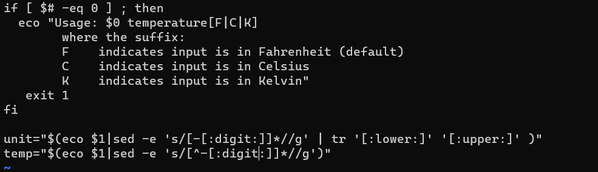
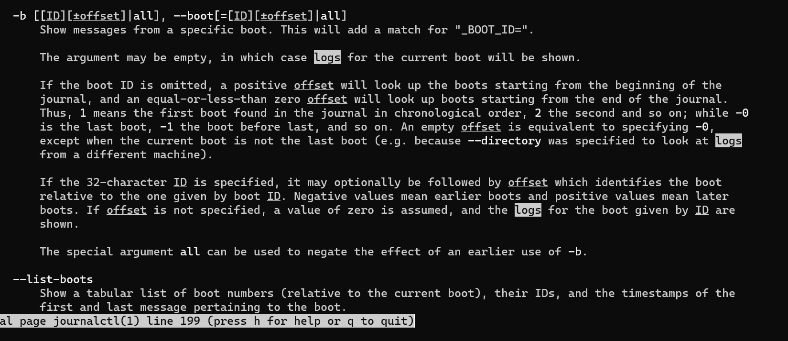
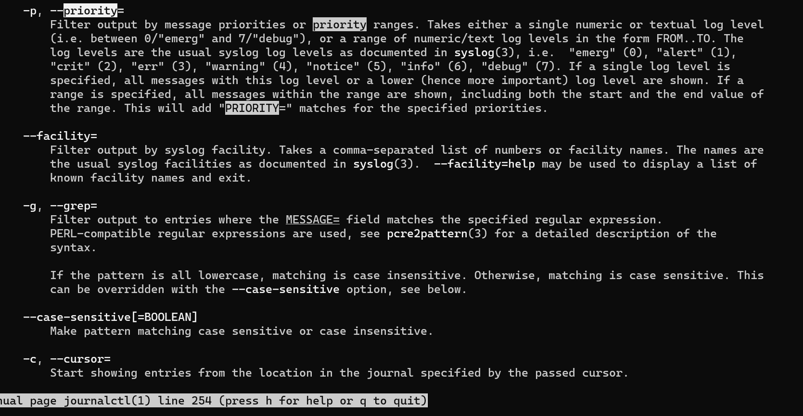
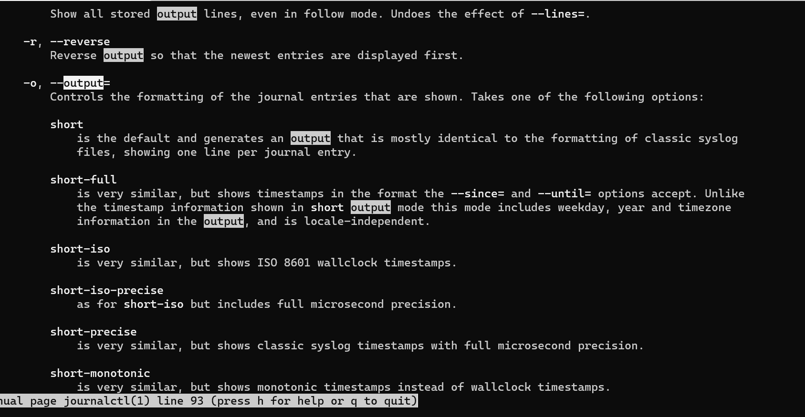

# Exam_2420
## Part 1:
```
sudo apt update
sudo apt upgrade
```
## Part 2:

for the single character changes. I used `R` command to replace the existing character to the new one
for changing "numbs" to ":digits:" I used `I`
<br>

## Part 3:
The code is:
```
journalctl -b -p warning -o json
```
To find the options to put I used `/` to search through the man pages. Keywords I searched are 'logs', 'priority', and 'output'




## Part 4:
```
#!/bin/bash

users_data=$(grep -E ':[0-9]{4}:' /etc/passwd | awk -F: '{ if ($3 >= 1000 && $3 <= 5000) print $1, $3, $7 }')

logged_in_users=$(who | awk '{ print $1 }')

echo "Regular users:" > /etc/motd
echo "$users_data" >> /etc/motd
echo "" >> /etc/motd
echo "Currently logged in users:" >> /etc/motd
echo "$logged_in_users" >> /etc/motd
```

## Part 5:
```
[Unit]
Description=run the test_file with the exam script

[Service]
Type=oneshot
ExecStart=/bin/bash /home/vagrant/test_file

[Install]
WantedBy=multi-user.target
```

added the service file to /etc/systemd/system/

## Part 6:
```
[Unit]
Description=Timer to start the test_file.service script

[Timer]
Unit=test_file.service
OnBootSec=60s
Persistent=true

[Install]
WantedBy=multi-user.target
```
